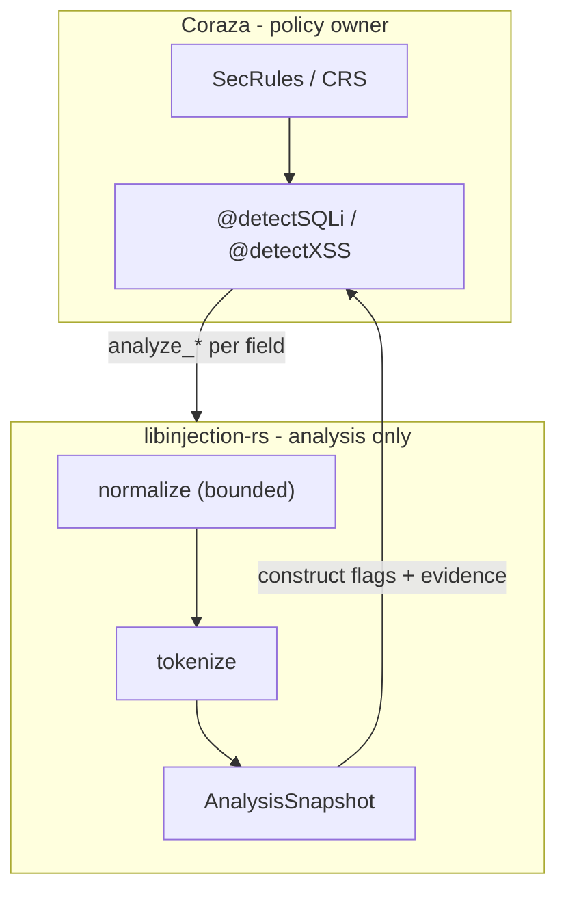

# libinjection-rs Implementation Plan

**Status:** Ready to build (WAF-first modern rewrite)  
**Last updated:** 2026-07-17 (scan budget as Coraza policy; defaults + AnalyzeOptions + absolute clamp)  
**Primary consumer:** [coraza-rs](../../coraza-rs/) (`@detectSQLi`, `@detectXSS`)  
**Behavioral parity target:** [libinjection-go v0.3.2](https://github.com/corazawaf/libinjection-go) via `legacy` feature + construct engine

---

## Changelog

| Date | Change |
|------|--------|
| **2026-07-17** | **Scan budget as Coraza policy:** stage-1 input scan cap is a **default** (`DEFAULT_MAX_INPUT_LEN`) overridable via `AnalyzeOptions`, clamped by `ABSOLUTE_MAX_INPUT_LEN`. Stack buffer sizes remain hard requirements. See [MODERNIZATION_PLAN.md § Scan budget](./MODERNIZATION_PLAN.md#scan-budget-caller-policy). |
| **2026-07-09** | **Hot-path + phases addendum:** `AnalysisSnapshot` includes verdict hint; deep guardrails (2 KiB cap, bounded nodes); phases 6 = deep, 7 = bypass/fuzz/alloc-guard; separate fast/deep benchmarks; deep not in default Coraza wiring. |
| **2026-07-09** | **`deep` addendum:** optional second-stage `analyze_sqli_deep` with `sqlparser` behind `deep` feature (OFF by default); Coraza decides when stage 2 runs - not automatic per field. |
| **2026-07-09** | **WAF-first + Coraza-owns-rules pivot.** Library emits `AnalysisSnapshot` (construct flags, evidence spans); policy/rules live in Coraza, not embedded YAML in this crate. Phases restructured: 2a legacy parity, 2b modern engine, 3–6 Coraza integration + hardening + benchmarks. See [MODERNIZATION_PLAN.md](./MODERNIZATION_PLAN.md). |
| 2026-07-08 | Initial plan: direct fingerprint-blacklist port mirroring libinjection-go as primary engine. |

---

## Scope

### In scope

- Pure-Rust **analysis library** on the WAF hot path: SQL injection + XSS construct detection
- **`AnalysisSnapshot`** API - fixed-size, zero-alloc, stack-only
- Integration with **native coraza-rs** via `operators/detection.rs`
- **`legacy` feature** - fingerprint engine + 499-test corpus parity
- **`deep` feature (optional)** - second-stage `sqlparser` analysis; OFF by default; Coraza-triggered only
- Minimal runtime dependencies (core hot path: **only `memchr`**)
- WASM-safe design for future embedders

### Out of scope (this effort)

- Embedded policy / rule packs in this crate
- SecRule actions, block/log/deny decisions
- Building an Envoy WASM plugin or proxy-wasm filter
- ML on hot path
- **`sqlparser` or heavy parsers on stage-1 default path** (see `deep` feature for opt-in stage 2)
- Automatic `deep` escalation on every field scan
- Heap allocation on `detect_sqli` / `detect_xss` default path

### Design constraint (not a deliverable)

The library must be **safe to embed** in future WASM runtimes: `no_std`-friendly, minimal deps, no panics on untrusted input. See [WASM_PORTABILITY.md](./WASM_PORTABILITY.md).



---

## WAF hot-path (overrides embedded rule packs)

The default `detect_*` / `analyze_*` path is the **only** path for CRS 941/942 unless Coraza explicitly opts into `deep`. No embedded rule packs in this crate.

| Requirement | Specification |
|-------------|---------------|
| **Allocation** | Zero heap - no `Vec` / `String` / `Box` on default path |
| **Memory model** | Stack-only, bounded buffers, early exit |
| **Latency** | p99 ≤ legacy libinjection-go @ 256 B and 1 KiB |
| **Output** | Fixed-size `AnalysisSnapshot`: `ConstructFlags`, evidence spans, **verdict hint**, optional derived `legacy_fingerprint` |
| **Policy** | Rules live in **Coraza** (SecRules/CRS) - see [library vs Coraza boundary](./MODERNIZATION_PLAN.md#library-vs-coraza-boundary) |

---

## Hot-path contract

Full specification: [MODERNIZATION_PLAN.md § Hot-path contract](./MODERNIZATION_PLAN.md#hot-path-contract).

| Parameter | Value | Soft / hard |
|-----------|-------|-------------|
| Max stack per call | ≤ **4 KiB** (target ~1–2 KiB) | **Hard** (layout) |
| Default max input scanned | **8192 bytes** (`DEFAULT_MAX_INPUT_LEN`) | **Soft** - Coraza may raise via `AnalyzeOptions` |
| Absolute max input scanned | **65536 bytes** (`ABSOLUTE_MAX_INPUT_LEN`) | **Hard** clamp - never unbounded |
| Normalization buffer | **512 bytes** stack | **Hard** |
| Token buffer | **`[TokenMeta; 8]`** - offsets only | **Hard** |
| Evidence spans | **`[EvidenceSpan; 4]`** | **Hard** |
| Heap allocation | **Zero** on `analyze_*` / `detect_*` default path | **Hard** |
| Complexity | **O(n)** over **scanned** bytes with early exit | **Hard** |
| p99 latency | ≤ libinjection-go @ 256 B and 1 KiB (**default** scan profile) | CI gate on default; raised-cap profile optional |

Scan budget policy: [MODERNIZATION_PLAN.md § Scan budget](./MODERNIZATION_PLAN.md#scan-budget-caller-policy).

---

## Target API

### Primary (modern)

```rust
pub fn analyze_sqli(input: &[u8]) -> AnalysisSnapshot;
pub fn analyze_xss(input: &[u8]) -> AnalysisSnapshot;

pub fn analyze_sqli_with(input: &[u8], opts: AnalyzeOptions) -> AnalysisSnapshot;
pub fn analyze_xss_with(input: &[u8], opts: AnalyzeOptions) -> AnalysisSnapshot;

pub fn detect_sqli(input: &[u8]) -> DetectionVerdict;  // built-in minimal policy
pub fn detect_xss(input: &[u8]) -> DetectionVerdict;
pub fn detect_sqli_with(input: &[u8], opts: AnalyzeOptions) -> DetectionVerdict;
pub fn detect_xss_with(input: &[u8], opts: AnalyzeOptions) -> DetectionVerdict;
```

`analyze_*` / `detect_*` without options use `AnalyzeOptions::default()` (`max_input_len = DEFAULT_MAX_INPUT_LEN`).

`AnalysisSnapshot`, `ConstructFlags`, and evidence types: [MODERNIZATION_PLAN.md § AnalysisSnapshot API spec](./MODERNIZATION_PLAN.md#analysissnapshot-api-spec).

### Coraza integration

[`coraza-rs/src/operators/detection.rs`](../../coraza-rs/src/operators/detection.rs):

```rust
let verdict = libinjection::detect_sqli(input.as_bytes());
if verdict.detected {
    if let Some(fp) = verdict.snapshot.legacy_fingerprint.as_str() {
        tx.capture_field(0, fp);  // audit boundary - String alloc OK here
    }
    true
} else {
    false
}
```

**Library vs Coraza boundary:** [MODERNIZATION_PLAN.md § Library vs Coraza boundary](./MODERNIZATION_PLAN.md#library-vs-coraza-boundary).

---

## Architecture

### Default hot path (modern engine)

```
Input &[u8]
  → prefilter (memchr) → early benign exit
  → normalize (512B stack, TRUNCATED on overflow)
  → tokenize → [TokenMeta; 8] (offsets, not copies)
  → construct classify → ConstructFlags + VerdictHint
  → [legacy feature] derive LegacyFingerprint
  → AnalysisSnapshot
```

### Optional stage 2 (`deep` feature - OFF by default)

```toml
deep = ["dep:sqlparser", "alloc"]
```

| Rule | Detail |
|------|--------|
| **When** | Second stage only - **never** on default hot path or default `@detectSQLi` integration |
| **Who decides** | Coraza: operator arg (e.g. `@detectSQLi:deep`) or inconclusive escalation (**target <1%** of scans) |
| **Input cap** | **2 KiB** max for deep parse (stricter than stage-1 8 KiB) |
| **Dialect** | **Single dialect** per call (from stage-1 `AnalysisContext` hint) |
| **Parse budget** | **Bounded AST nodes**; bail with partial snapshot on budget exhaustion |
| **WASM** | `wasm32` core build: `deep` disabled - no `sqlparser` linked |
| **Benchmarks** | Separate **fast-path** vs **deep-path** Criterion benches; **CI fails on fast-path regression** |

Full design: [MODERNIZATION_PLAN.md § Deep analysis](./MODERNIZATION_PLAN.md#deep-analysis-deep-feature--off-by-default).

```
Stage 1 (every scan):  analyze_* → AnalysisSnapshot  [zero heap]
Stage 2 (opt-in):      analyze_sqli_deep(input, &prior)  [sqlparser + alloc, guarded]
```

### Legacy compat (`legacy` feature)

- **Parity engine** behind `legacy` feature - 499-test corpus, fingerprint blacklist, `notWhitelist()` FP tuning
- **`legacy_fingerprint`** is a **derived compat view** from the shared tokenize/fold pipeline - **not** the primary internal model
- Modern engine primary signal: **`ConstructFlags`** in `AnalysisSnapshot`
- Coraza audit: `capture_field(0, fingerprint)` from derived `legacy_fingerprint` when `legacy` enabled
- Coraza default build: `features = ["legacy", "std"]` - **not** `deep`

Reference: [LIBINJECTION_GO_ANALYSIS.md](./LIBINJECTION_GO_ANALYSIS.md), [LIBINJECTION_C_ANALYSIS.md](./LIBINJECTION_C_ANALYSIS.md)

### Critical parity requirements (`legacy` feature)

1. **499 test files** from libinjection-go `tests/` - 100% pass with `legacy`
2. **9,352 keyword/fingerprint entries** (8,367 `"0..."` fingerprints)
3. **256-entry byte parser dispatch table** - bit-identical to Go
4. **All fold rules** - evaluation order is security-critical
5. **5 XSS HTML entry contexts**
6. **`notWhitelist()` FP branches**

### XSS

HTML5 tokenizer (5 contexts) → construct flags (`XSS_*` bits) + optional legacy blacklist path under `legacy`.

## Dependency Policy

| Tier | Crate / feature | Notes |
|------|-----------------|-------|
| **Runtime (stage 1)** | `memchr` | Only runtime dep on default hot path; `default-features = false` |
| **`std` feature** | `memchr/std` | Native SIMD CPU detection - optional |
| **`legacy` feature** | build.rs table codegen | Fingerprint blacklist; Coraza default until CRS migration |
| **`deep` feature** | `sqlparser` + `alloc` | **OFF by default**; second stage only; Coraza decides when |
| **Build-only** | `phf_codegen` | Only when `legacy` feature enabled |
| **Avoid (stage 1)** | `smallvec`, `bitflags`, `regex`, `serde` | Fixed arrays, const flags, hand-written parser |
| **`sqlparser`** | Optional dep | **Only** with `deep` - never stage-1 hot path |
| **Never** | `proxy-wasm`, `tokio`, embedded rule YAML | Consumer / filter concerns |

```toml
[package]
name = "libinjection"
edition = "2024"

[lib]
crate-type = ["rlib"]

[features]
default = ["legacy"]
std = ["memchr/std"]
legacy = []
deep = ["dep:sqlparser", "alloc"]   # OFF by default
alloc = []

[dependencies]
memchr = { version = "2", default-features = false }
sqlparser = { version = "0.54", optional = true, default-features = false, features = ["std"] }

[build-dependencies]
# phf_codegen only compiled when legacy feature requests table generation
```

---

## Crate Layout

```
libinjection-rs/
├── Cargo.toml
├── build.rs                    # legacy feature: fingerprint/keyword tables from Go/C data
├── src/
│   lib.rs                      # analyze_*, detect_*, re-exports
│   limits.rs                   # DEFAULT_/ABSOLUTE_MAX_INPUT_LEN, DEEP_*, NORM_BUF_LEN, stack budget
│   options.rs                  # AnalyzeOptions (scan budget); Default = stage-1 defaults
│   snapshot.rs                 # AnalysisSnapshot, ConstructFlags, VerdictHint, EvidenceSpan
│   error.rs
│   sqli/
│   │   mod.rs                  # analyze_sqli, detect_sqli
│   │   normalize.rs            # bounded stack normalization
│   │   constructs.rs           # construct detectors (modern primary)
│   │   state.rs                # SqliState<'a> - stack-only
│   │   token.rs                # TokenMeta
│   │   parse.rs                # byteParsers[256] dispatch
│   │   legacy/                 # #[cfg(feature = "legacy")]
│   │       fold.rs
│   │       fingerprint.rs
│   │       lookup.rs
│   │   deep/                   # #[cfg(feature = "deep")] - sqlparser stage 2
│   │       mod.rs
│   │       sqlparser_bridge.rs
│   xss/
│   │   mod.rs
│   │   html5.rs
│   │   constructs.rs
│   │   legacy/                 # #[cfg(feature = "legacy")]
│   │       blacklist.rs
├── tests/
│   corpus/                     # libinjection-go tests/ (499 files)
│   corpus_driver.rs
│   no_alloc.rs                 # assert zero heap on detect_* / analyze_*
└── docs/
    IMPLEMENTATION_PLAN.md
    MODERNIZATION_PLAN.md
    ...
```

---

## Implementation Phases

### Phase 0 - Workspace + library scaffold

**Goal:** Empty but correct crate structure; CI gates in place.

- [ ] Root workspace `Cargo.toml` with members `coraza-rs`, `libinjection-rs`
- [ ] Convert `libinjection-rs` to `[lib]` rlib (remove stub `main.rs`)
- [ ] Features: `default = ["legacy"]`, `std`, `legacy`, `deep`, `alloc`
- [ ] `limits.rs` - defaults + absolute scan clamps; hard stack buffer constants
- [ ] `options.rs` - `AnalyzeOptions` stub (`max_input_len`; `Default` → `DEFAULT_MAX_INPUT_LEN`)
- [ ] `snapshot.rs` type stubs (incl. `VerdictHint`)
- [ ] Stub `analyze_*` / `analyze_*_with` / `detect_*` / `detect_*_with`
- [ ] `build.rs` skeleton (no-op unless `legacy`)
- [ ] Tier 1 linting + wasm32 CI:
  ```bash
  cargo check -p libinjection --target wasm32-wasip1 --no-default-features
  ```

**Exit criteria:** `cargo check` / `cargo test` pass; wasm32 `--no-default-features` clean.

---

### Phase 1 - Test harness (TDD first)

**Goal:** Corpus drivers before algorithm code.

- [ ] Vendor libinjection-go `tests/` (499 files)
- [ ] Corpus parser (`--TEST--`, `--INPUT--`, `--EXPECTED--`)
- [ ] Drivers: sqli, folding, tokens, html5, xss
- [ ] Supplementary Go unit tests (scientific notation, PortSwigger, issue #46)

**Exit criteria:** Drivers run; baseline documented (expected failures).

---

### Phase 2a - Legacy parity (`legacy` feature)

**Goal:** 100% libinjection-go corpus via fingerprint-blacklist engine.

- [ ] `SqliState<'a>` - stack-only
- [ ] `byteParsers[256]`, fold, fingerprint, blacklist, whitelist, multi-pass `check()`
- [ ] XSS HTML5 + legacy blacklists
- [ ] `build.rs` generates static lookup tables
- [ ] `detect_sqli` / `detect_xss` legacy implementations
- [ ] Populate `LegacyFingerprint` in snapshot

**Exit criteria:** 100% pass on 499 corpus with `--features legacy`.

---

### Phase 2b - Modern engine + AnalysisSnapshot

**Goal:** Construct classification as default analysis output; stack-only.

- [ ] Bounded normalization + `TRUNCATED` flag
- [ ] Token buffer with offsets (no copies)
- [ ] SQL construct detectors: UNION, TAUTOLOGY, STRING_BREAK, STACKED_QUERY, COMMENT_INJECTION, etc.
- [ ] XSS construct detectors: XSS_TAG_*, XSS_EVENT_HANDLER, XSS_URL_*, etc.
- [ ] `analyze_sqli` / `analyze_xss` → `AnalysisSnapshot`
- [ ] `detect_*` built-in minimal policy on `ConstructFlags`
- [ ] `no_alloc.rs` test + Miri on parser modules

**Exit criteria:** Snapshot populated on corpus samples; zero alloc tests pass; no panic on fuzz smoke.

---

### Phase 3 - Coraza integration

**Goal:** coraza-rs uses local `libinjection-rs`; detection.rs uses snapshot API.

- [ ] Path dependency in [`coraza-rs/Cargo.toml`](../../coraza-rs/Cargo.toml) - **no `deep` feature**:
  ```toml
  libinjection = { path = "../libinjection-rs", features = ["legacy", "std"] }
  ```
- [ ] Update [`detection.rs`](../../coraza-rs/src/operators/detection.rs): `DetectionVerdict`, legacy fingerprint capture
- [ ] Wire optional scan budget from WAF config → `AnalyzeOptions` (default 8192; never from untrusted request input)
- [ ] coraza-rs operator unit tests green
- [ ] CRS 941xxx / 942xxx compatibility tests

**Exit criteria:** coraza-rs test suite green; `@detectSQLi` / `@detectXSS` functional; scan budget configurable at WAF init.

---

### Phase 4 - Coraza rule-matching interface

**Goal:** Document and prototype construct-based matching off hot path.

- [ ] Document WAF init: compile SecRules → read-only `ConstructMask` matchers
- [ ] `@detectSQLi` built-in policy = minimal construct set for backward compat
- [ ] Design note: future operator exposing full snapshot for CRS construct rules
- [ ] Validate CRS 941/942 with construct + legacy dual path

**Exit criteria:** Interface documented in MODERNIZATION_PLAN + coraza-rs design note; CRS tests green.

---

### Phase 5 - Construct hardening

**Goal:** Improve detection without heap - brackets, comments, dialect hints.

- [ ] MSSQL bracket identifiers, MySQL `#` / `/*!`, Oracle hints
- [ ] Comment injection variants (`--`, `#`, `/**/`)
- [ ] Stacked query edge cases
- [ ] XSS context-specific construct refinement
- [ ] All changes stack-only; no new runtime deps

**Exit criteria:** Bypass corpus improvements on stage 1; no alloc/perf regression on default path.

---

### Phase 6 - Optional `deep` second stage (`sqlparser`)

**Goal:** `analyze_sqli_deep` behind `deep` feature; not wired into default Coraza operators.

- [ ] `deep = ["dep:sqlparser", "alloc"]` - optional dependency
- [ ] `analyze_sqli_deep(input, &AnalysisSnapshot)` with guardrails:
  - [ ] **2 KiB** input cap for deep parse
  - [ ] **Single dialect** per call (from stage-1 context)
  - [ ] **Bounded AST node count**; bail on budget → partial upgraded snapshot
- [ ] Coraza trigger docs: operator arg; inconclusive escalation (**<1%** of scans target)
- [ ] `detect_sqli` / `analyze_sqli` **never** call deep internally
- [ ] CI: `cargo check --features deep` (native only); wasm32 core excludes `deep`
- [ ] Separate Criterion bench for deep path (not gated against fast-path SLO)

**Exit criteria:** Deep API + guardrails documented; stage-1 no-alloc tests pass without `deep`.

---

### Phase 7 - Bypass, differential, fuzz, alloc-guard

**Goal:** Production readiness - validation without compromising fast path.

- [ ] **Zero-alloc hot path test** (`tests/no_alloc.rs`) - fails CI if stage-1 allocates
- [ ] **Fast-path benchmarks** vs libinjection-go: p99 @ 256 B and 1 KiB - **CI fails on regression**
- [ ] Curated **bypass corpus** (beyond 499 tests); modern engine **≥ legacy TP**, no FP regression
- [ ] **Differential tests**: stage-1 vs `legacy` feature on shared inputs
- [ ] `cargo-fuzz` targets on `analyze_*` (stage 1)
- [ ] Miri on parser modules
- [ ] Verify **deep not in default Coraza wiring** (Cargo.toml + detection.rs audit)

**Exit criteria:** All success criteria met; fast-path bench gate green; bypass corpus report documented.

---

## Success Criteria

| Criterion | Target |
|-----------|--------|
| **Zero-alloc hot path** | Custom test + Miri - stage 1 only; CI gate |
| **WASM-safe core** | `wasm32-wasip1 --no-default-features` clean (no `sqlparser`) |
| **Legacy corpus** | 100% with `legacy` feature (499 files) |
| **Fast-path benchmark** | p99 ≤ libinjection-go @ 256 B and 1 KiB; **CI fails on regression** |
| **Bypass corpus** | Modern engine ≥ legacy TP; **no FP regression** vs legacy |
| **coraza-rs + CRS** | Tests green; 941/942 operators functional |
| **Policy location** | Rules in Coraza/CRS only - none embedded in crate |
| **Deep wiring** | **`deep` not in default Coraza** `Cargo.toml` or `@detectSQLi` path |

**Not success criteria:** Shipping a WASM filter; ML; automatic `deep` on every scan.

---

## Addendum summary

### WAF hot-path

Default `detect_*`: zero heap, stack-only, early exit, p99 ≤ legacy. Library emits fixed-size `AnalysisSnapshot` (`ConstructFlags`, evidence spans, **verdict hint**) - no heap types. Rules/policy in Coraza only.

### Legacy compat

Parity engine behind `legacy` (499 corpus, CRS audit field 0). `legacy_fingerprint` **derived from snapshot** - not the primary internal model.

### Optional `deep` (OFF by default)

```toml
deep = ["dep:sqlparser", "alloc"]
```

Second stage only; never default hot path or `@detectSQLi`. Coraza decides: operator arg or inconclusive escalation (<1% scans). Guardrails: 2 KiB cap, single dialect, bounded nodes, bail on budget. wasm32 core: deep disabled. Separate fast vs deep benchmarks.

### Phases

`2a` legacy parity → `2b` AnalysisSnapshot + constructs → `3` Coraza integration → `4` Coraza rule interface → `5` construct hardening → `6` deep (sqlparser) → `7` bypass / differential / fuzz / alloc-guard

Full spec: [MODERNIZATION_PLAN.md](./MODERNIZATION_PLAN.md).

---

## Checklist (quick reference)

```
Phase 0   [ ] workspace  [ ] lib crate  [ ] limits+options  [ ] snapshot types  [ ] wasm32 CI
Phase 1   [ ] corpus  [ ] drivers  [ ] baseline
Phase 2a  [ ] legacy SQLi  [ ] legacy XSS  [ ] 499 tests green
Phase 2b  [ ] normalize  [ ] constructs  [ ] analyze_*  [ ] no_alloc test
Phase 3   [ ] coraza path dep  [ ] detection.rs  [ ] CRS 941/942
Phase 4   [ ] rule-matching docs  [ ] construct interface design
Phase 5   [ ] dialect/comments/brackets  [ ] XSS hardening
Phase 6   [ ] deep (sqlparser)  [ ] guardrails  [ ] analyze_sqli_deep
Phase 7   [ ] bypass corpus  [ ] differential  [ ] fuzz  [ ] alloc-guard  [ ] fast bench CI
```

---

## Related Documentation

| Document | Purpose |
|----------|---------|
| [MODERNIZATION_PLAN.md](./MODERNIZATION_PLAN.md) | AnalysisSnapshot spec, Coraza boundary, modern engine |
| [WASM_PORTABILITY.md](./WASM_PORTABILITY.md) | Embedder constraints |
| [RUST_BEST_PRACTICES.md](./RUST_BEST_PRACTICES.md) | Memory, performance, API design |
| [RUST_LINTING_SETUP.md](./RUST_LINTING_SETUP.md) | Tooling and CI tiers |
| [LIBINJECTION_GO_ANALYSIS.md](./LIBINJECTION_GO_ANALYSIS.md) | Legacy engine behavioral reference |
| [LIBINJECTION_C_ANALYSIS.md](./LIBINJECTION_C_ANALYSIS.md) | Algorithm authority |
| [README.md](./README.md) | Research index and executive summary |
